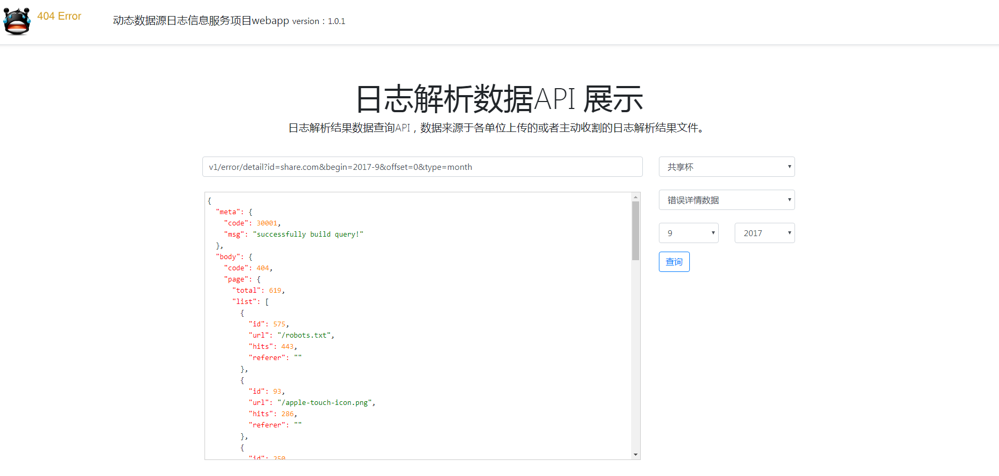
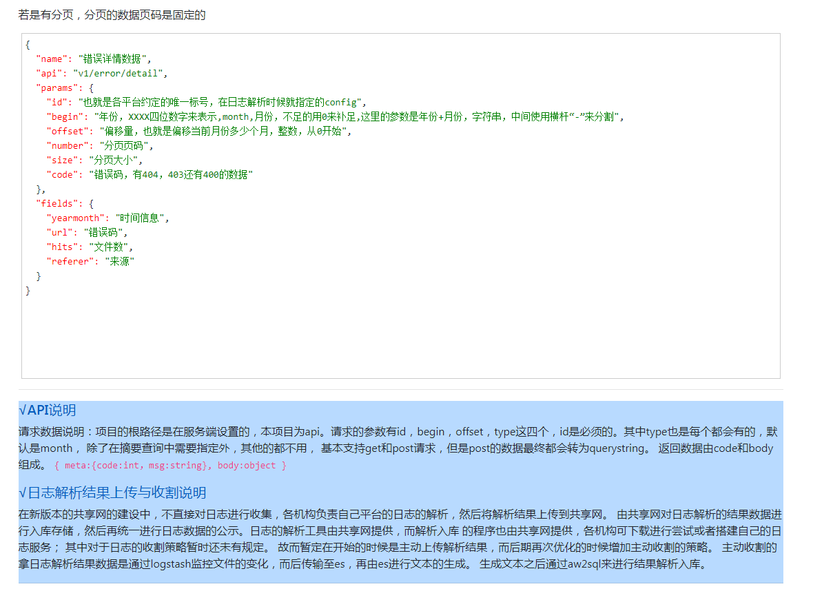
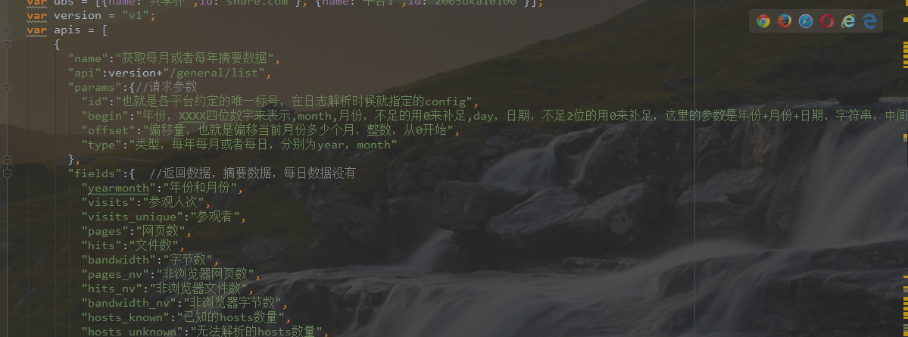

----------------
log-analytics
-----------------

#### 项目来源：
 awstats解析网站日志的结果是txt文档，然后结合apache,nginx等应用服务器来完成在网页上的展示。但是这项目这对其他项目不能很好的支持，不能异步完成调用来查询数据。
 而且对于awstats不熟悉（开发语言perl），于是寻找了一些工具来对解析结果的文档数据进行入库或者直接以api形式服务。最终找到了
 一个项目——可以将awstats解析结果的数据入库到mysql，尝试了一下，项目运行有一些问题，但是基本能用，数据入库到mysql之后，
 对于单个网站来说很容易集成到系统中，但是对于多个网站来说，每次都是生成新的数据库。因此对于数据的统一调用就不是很方便。所以便打算写一个项目来完成这样的一个任务——每次传入不同的数据库名称来查询数据。

 整个的日志数据服务的流程是：
 日志通过awstats来进行解析的，得到txt的解析结果，解析结果文档（比日志小了很多）上传至平台，然后由平台对解析结果进行维护。
这里而awstats的解析结果是由aw2sql来进行入库的，入库之后的数据是有很多个数据库，因此再运行此项目来进行服务数据的查询调用。

#### 项目模块说明
（1）generator是用来生成mybatis通用代码的；

（2）ddsdb：这个模块是根据提供的database name 来生成DataSource，并且在这里管理datasource数据源和数据连接；项目就依赖于mysql驱动库；

（3）api：是对外服务的项目代码。项目依赖于mybatis（数据库查询方便），jetty：服务提供者，jersey：rest API提供者，这里service是被管理起来的。
其中主要是service包下面的BaseService和ServiceManager。还有便是web包下面的过滤器。其中主要在ServiceFilter里面完成校验；
校验主要是对查询请求id校验，同时将post的参数转换成get的querystring。
还有就是对每个controller（MatchedResource）里面的service进行生成。
每个service必须继承BaseService，然后通过sqlSession获取Mapper信息。

#### 项目运行
（1）运行api模块代码里面的LogAPIApplication main方法即可；

（2）或者间api的war包加载到tomcat里面去运行；

（3）注意：main方法运行的时候把web.xml里面的default servlet和mapping打开，这样能编辑HTML（jetty项目）；在tomcat里面运行的时候需要关闭，否则会报错；

（4）代码运行：可以打war包运行，对于jar包运行还不行（在main里面启动的是jetty的webcontext）；

（5）代码运行起来后可以查看api信息，api调用与查看写了一个页面来完成。（页面写在api模块下的webapp里面）

#### 相关项目
[aw2sql](https://github.com/zw231212/aw2sql)

#### 一些截图
 查询界面

api说明展示

api说明代码

